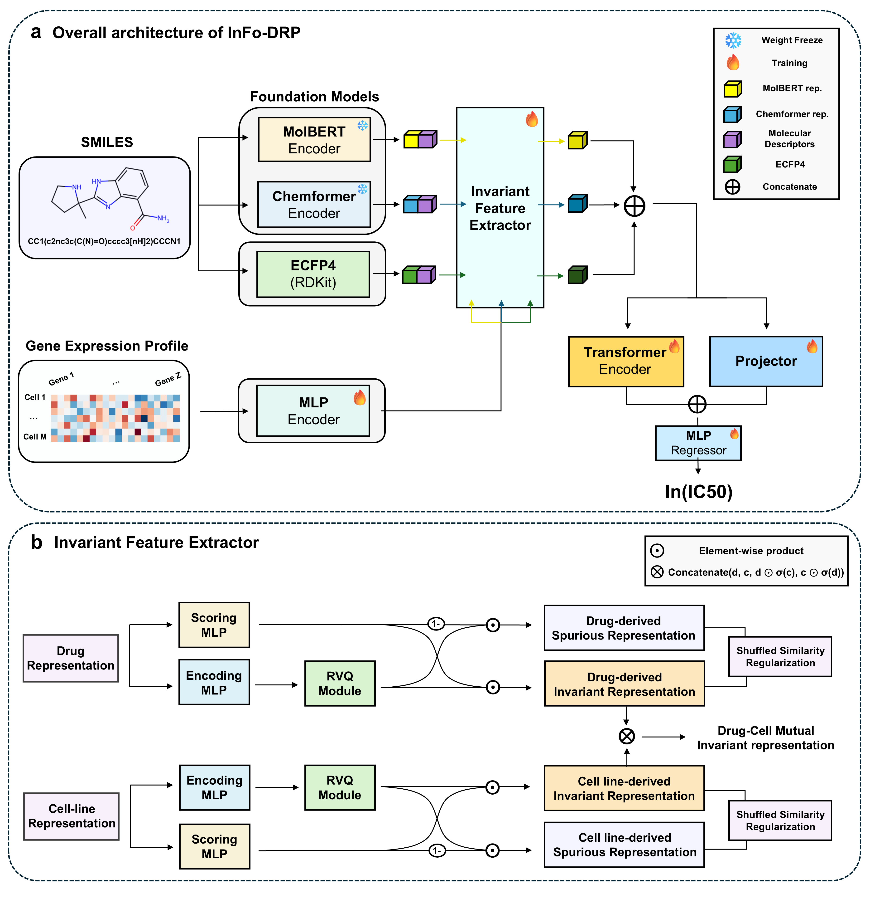

# InFo-DRP

**InFo-DRP** is a drug response prediction framework that improves robustness under chemical distribution shift by coupling invariant learning with foundation-model drug representations.

The model is evaluated on **GDSCv1** and **GDSCv2** benchmarks under drug-blind, cell-blind, scaffold-blind, and random-split settings.

This repository provides full training and evaluation code, predefined data splits, and trained model checkpoints used to report the results in the paper.

---

## Repository Structure

```
InFo-DRP/
├── checkpoint/        # (Optional) Directory for storing downloaded trained model checkpoints
├── data/              # Processed GDSC data and predefined splits
│   ├── gdscv1/
│   └── gdscv2/
├── result/            # Evaluation outputs and prediction files
├── src/               # Source code
│   ├── dataset.py
│   ├── model.py
│   ├── util.py
│   └── main.py
├── environment.yml    # Conda environment specification
└── README.md
```

---

## Environment Setup

We recommend using **conda** to reproduce the experimental environment.

```bash
conda env create -f environment.yml
conda activate infodrp
```

Verify PyTorch and CUDA:

```bash
python -c "import torch; print(torch.__version__, torch.cuda.is_available(), torch.version.cuda)"
```

---

## GPU Selection

GPU selection must be performed **before running the script** by setting the `CUDA_VISIBLE_DEVICES` environment variable.

```bash
CUDA_VISIBLE_DEVICES=0 python src/main.py ...
```

---

## Running Experiments

This section provides example commands for all generalization settings evaluated in the paper.

### GDSCv1 Experiments

GDSCv1 is evaluated under **drug-blind**, **cell-blind**, and **random-split** settings.

#### • Drug-blind (newDRUG)
```bash
CUDA_VISIBLE_DEVICES=0 python src/main.py \
  --dataset gdscv1 \
  --split_mode newDRUG \
  --exp_name infodrp_gdscv1_newDRUG
```

#### • Cell-blind (newCELL)
```bash
CUDA_VISIBLE_DEVICES=0 python src/main.py \
  --dataset gdscv1 \
  --split_mode newCELL \
  --exp_name infodrp_gdscv1_newCELL
```

#### • Random-split (newPAIR)
```bash
CUDA_VISIBLE_DEVICES=0 python src/main.py \
  --dataset gdscv1 \
  --split_mode newPAIR \
  --exp_name infodrp_gdscv1_newPAIR
```

---

### GDSCv2 Experiments

GDSCv2 is evaluated under **scaffold-blind**, **drug-blind**, and **cell-blind** settings.

#### • Scaffold-blind (newSCAFFOLD)
```bash
CUDA_VISIBLE_DEVICES=0 python src/main.py \
  --dataset gdscv2 \
  --split_mode newSCAFFOLD \
  --exp_name infodrp_gdscv2_newSCAFFOLD
```

#### • Drug-blind (newDRUG)
```bash
CUDA_VISIBLE_DEVICES=0 python src/main.py \
  --dataset gdscv2 \
  --split_mode newDRUG \
  --exp_name infodrp_gdscv2_newDRUG
```

#### • Cell-blind (newCELL)
```bash
CUDA_VISIBLE_DEVICES=0 python src/main.py \
  --dataset gdscv2 \
  --split_mode newCELL \
  --exp_name infodrp_gdscv2_newCELL
```

Additional training hyperparameters (e.g., learning rate, batch size, regularization
coefficients) can be configured via command-line arguments. See `python src/main.py --help`
for the full list of options.

---

### Evaluation Only (Reproducing Reported Results)

```bash
CUDA_VISIBLE_DEVICES=0 python src/main.py \
  --dataset gdscv2 \
  --split_mode newSCAFFOLD \
  --exp_name repro_gdscv2_newSCAFFOLD \
  --eval_only \
  --ckpt_dir checkpoint/InFo-DRP_gdscv2_NewScaffold_best_ckpt
```

---

## Outputs

Results are saved under the `result/` directory, including per-fold prediction CSV files and a summary JSON file reporting RMSE and PCC.

---

## Checkpoints

Due to file size limitations, trained model checkpoints corresponding to the results
reported in the paper are not included directly in this repository.

They can be downloaded from the following Google Drive link:

**[Google Drive – Trained Model Checkpoints](https://drive.google.com/drive/folders/1vgMqlhE6ESjkY5z__WGehO2IA-yQzqsS?usp=sharing)**

When running training commands, model checkpoints will be automatically saved under
the `checkpoint/` directory. The provided checkpoints can be optionally downloaded
to directly evaluate the reported results without retraining.

---

## Citation

Citation information will be added upon publication.
